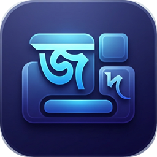

<p align="center">
  
</p>

<h1 align="center">জুলাই বাংলা কীবোর্ড · July Bangla Keyboard</h1>

<p align="center">
  <b>জুলাইয়ের অনুভূতি স্মরণ হোক, বাংলা লেখার মাধ্যমে।</b><br>
  ২০২৪ সালের জুলাইয়ের ছাত্র-জনতার গণঅভ্যুত্থানের স্মরণে
</p>

<p align="center">
  <a href="https://mahbubul-faizaexpress.github.io/july_bangla_keyboard/">Website</a> ·
  <a href="https://mahbubul-faizaexpress.github.io/july_bangla_keyboard/download.html">Download</a> ·
  <a href="https://mahbubul-faizaexpress.github.io/july_bangla_keyboard/guide.html">User guide</a> ·
  <a href="docs/ROADMAP.md">Roadmap</a>
</p>

A free Bangla keyboard with the Bijoy-compatible layout, for **Windows** and **Android**,
with Linux next. It has three modes:

| Mode | Output |
|---|---|
| **বাংলা** | Unicode Bangla, for the web, email and Office |
| **ক্লাসিক** | SutonnyMJ / Bijoy ANSI glyph codes, for legacy fonts |
| **English** | Plain Latin text |

`Ctrl+Alt+B` cycles through the modes on Windows. On Android, use the mode key.

## Highlights

- **Bijoy typing rules.** Pre-base kars come first, reph after its cluster, `g` links
  conjuncts, and অ + া = আ. Every layout row is verified against the master Bijoy chart.
- **Classic output.** All 222 SutonnyMJ glyph rows were verified in the font.
- **One engine everywhere.** A small C++20 engine (`src/engine`) is shared by the Windows
  text service and the Android keyboard. The same golden tests run for both.
- **Private by design.**
  - No network access, telemetry or ads.
  - No global keyboard hooks.
  - The Android app requests no permissions.
- **Native and small.**
  - Windows uses a TSF text service, with a ~2.8 MB installer.
  - Android uses an `InputMethodService` with an iPhone-style keyboard, in a ~0.6 MB APK.

## Status

Version **0.4.0 (preview)**.

| Platform | State |
|---|---|
| Windows 10/11 | Preview: installer, status bar, tray, splash |
| Android 7+ | Preview: on-screen keyboard and hardware keys |
| Linux (Fcitx5, IBus) | Planned next ([plan](docs/PLATFORMS.md)) |
| macOS | Planned |

The production gates are listed in [docs/RELEASE.md](docs/RELEASE.md).

## Repository layout

```
src/engine/      shared C++20 engine: layout, composer, Unicode and Classic backends
src/tip/         Windows TSF text service (JulyTip.dll)
src/app/         Windows companion: status bar, tray icon, splash (JulyBangla.exe)
src/common/      shared Windows code (settings, mode visuals)
android/         Android keyboard (Kotlin + JNI bridge to src/engine)
layouts/         Bijoy layout and the verified SutonnyMJ table (source of truth)
tests/           unit, golden, fuzz and generator tests; TSF smoke test
tools/           table generators, icon and website generators, build scripts
installer/       Inno Setup script
website/         project website (GitHub Pages)
docs/            architecture, layout, Classic mode, release and platform docs
```

## Build

**Windows.** You need the Visual Studio 2026 Build Tools (MSVC x64/x86, Windows 11 SDK,
CMake). See [docs/BUILD.md](docs/BUILD.md).

```
cmake --preset x64 && cmake --build --preset x64-release && ctest --preset x64-release
powershell -ExecutionPolicy Bypass -File tools\Build-Installer.ps1
```

**Android.** You need JDK 17, Android SDK 36, NDK 28.2 and CMake 3.31. See
[android/README.md](android/README.md).

```
cd android && gradlew assembleDebug testDebugUnitTest
```

## Documentation

- [Architecture](docs/ARCHITECTURE.md)
- [Keyboard layout](docs/KEYBOARD_LAYOUT.md)
- [Classic mode](docs/CLASSIC_MODE.md)
- [Compatibility](docs/COMPATIBILITY.md)
- [Performance](docs/PERFORMANCE.md)
- [Security design](docs/SECURITY.md)
- [Platforms plan](docs/PLATFORMS.md)
- [Release process](docs/RELEASE.md)
- [Microsoft Store submission](docs/STORE.md)
- [সমস্যা ও সমাধান (Troubleshooting)](docs/TROUBLESHOOTING.md)

## Contributing

Bug reports and ideas are welcome. Read [CONTRIBUTING.md](CONTRIBUTING.md) and the
[Code of Conduct](CODE_OF_CONDUCT.md). Report security issues privately; see
[SECURITY.md](SECURITY.md).

## License

Copyright © 2026 Mahbubul Alam.

July Bangla Keyboard is free software: you can redistribute it and/or modify it under the
terms of the **GNU General Public License, version 3 or (at your option) any later
version**. It is distributed without any warranty. See [LICENSE](LICENSE).

`layouts/sutonnymj.classic` is under MPL-2.0. The website font Hind Siliguri is under the
SIL OFL 1.1. See [THIRD_PARTY_NOTICES.md](THIRD_PARTY_NOTICES.md).

“Bijoy” is a trademark of its owner. This project is independent and not affiliated with
Bijoy.
