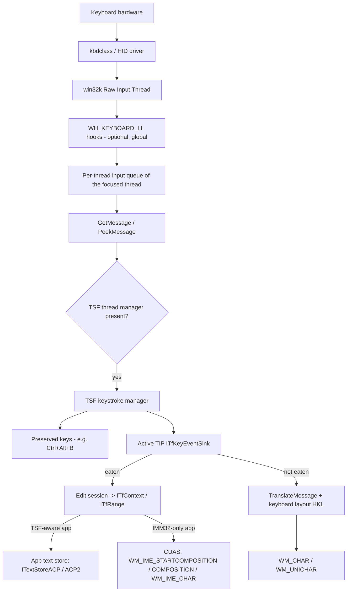
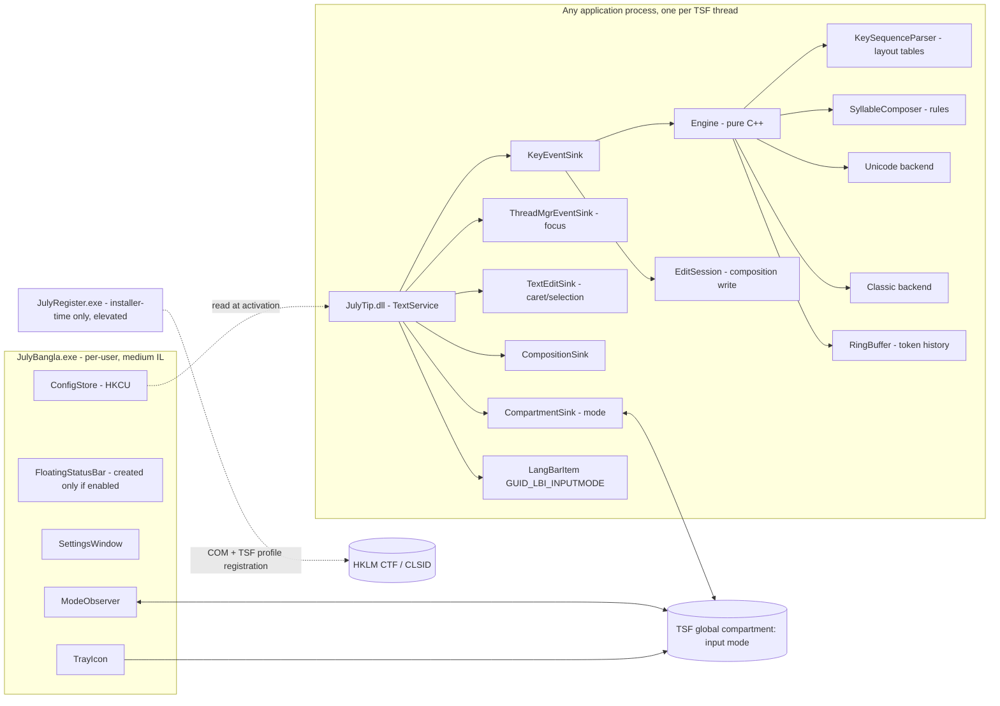
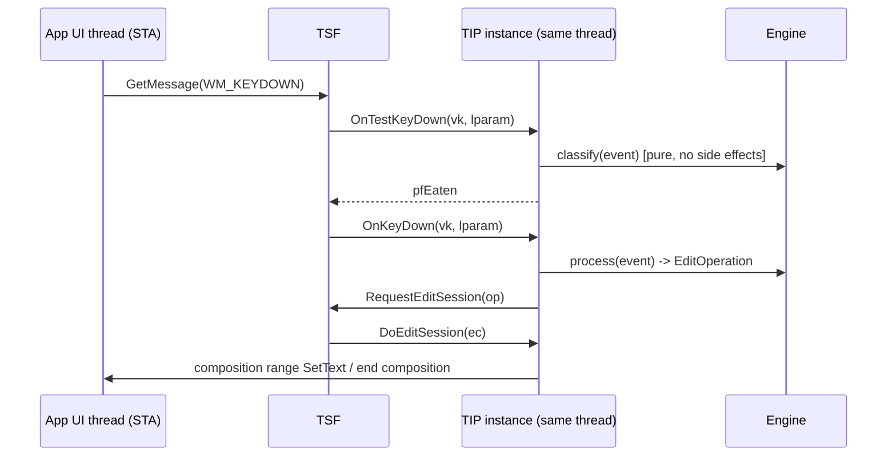
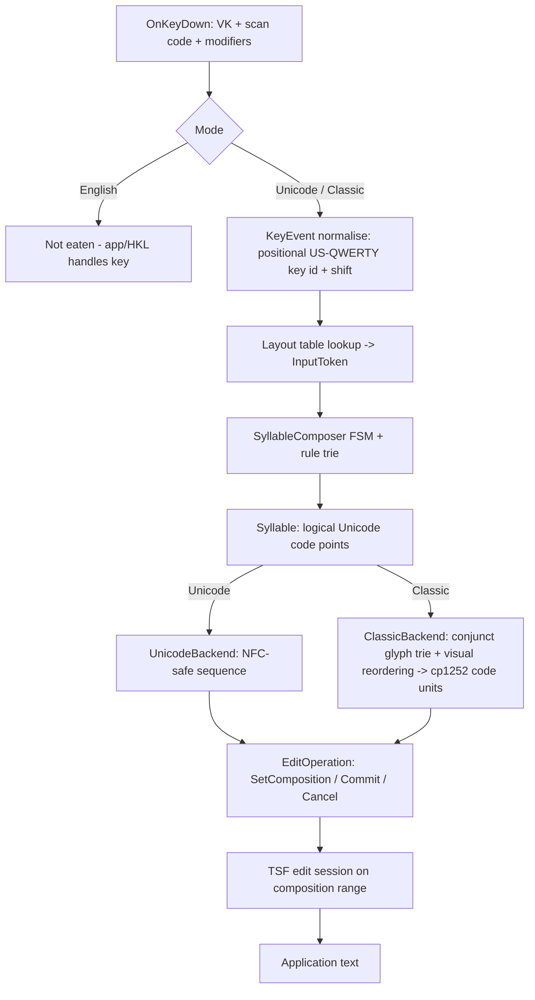

# Architecture — July Bangla Keyboard

Status: **Phase 0 (architecture baseline)**. Items marked **[VERIFY]** are design
assumptions that must be confirmed by a spike or by Microsoft documentation before the
phase that depends on them is closed. Nothing in this document is a measured result.

---

## 1. Executive summary

The product is a **Text Services Framework (TSF) Text Input Processor (TIP)**, plus a
small **companion process** for the tray icon, the floating status bar and settings.

- The TIP is an in-process COM DLL. TSF loads it into an application when the user has
  selected the "July Bangla Keyboard" input profile. It receives key events through
  `ITfKeyEventSink` and writes text through TSF **edit sessions** and **compositions**.
  It never injects synthetic keystrokes.
- Applications that do not use TSF (plain IMM32/Win32 apps) are still covered. Windows'
  built-in Cicero Unaware Application Support (CUAS) layer converts the TIP's composition
  into `WM_IME_COMPOSITION` / `WM_IME_CHAR` / `WM_CHAR` messages.
- All typing logic lives in a pure, platform-independent C++ **engine** that does not
  allocate per keystroke. The pipeline is: physical key → logical Bangla tokens →
  syllable composer → output backend. There are two backends: **Unicode** and **Classic**
  (SutonnyMJ/Bijoy ANSI glyph codes).
- The mode (English / Unicode / Classic) is held in a **TSF global compartment**. Every
  TIP instance and the companion see the same value. `Ctrl+Alt+B` is registered as a TSF
  **preserved key**, so it is only claimed while our input method is active.
- There is **no global keyboard hook, no `SendInput` and no foreground-window polling** in
  the core design. A fallback path will be built only if compatibility testing (Phase 8)
  shows a specific application needs one. It would be opt-in and documented.

## 2. Windows input stack — analysis



| Concept | Role in this product |
|---|---|
| **TSF** | The modern Windows text-input architecture. An application (or the system on its behalf) creates an `ITfThreadMgr` per UI thread. TIPs plug into it. |
| **TIP** | A COM object implementing `ITfTextInputProcessor(Ex)`. TSF creates **one TIP instance per thread manager, i.e. per UI thread** that has TSF active, inside the app's process. This is our main component. |
| **Language profile** | Ties a TIP CLSID to a LANGID (bn-BD `0x0845`) plus a profile GUID, name and icon. Users select it in Settings → Language, or with Win+Space. |
| **Categories** | `GUID_TFCAT_TIP_KEYBOARD`, `GUID_TFCAT_TIPCAP_IMMERSIVESUPPORT` (UWP/WinUI/Store apps), `GUID_TFCAT_TIPCAP_SYSTRAYSUPPORT`, `GUID_TFCAT_TIPCAP_UIELEMENTENABLED`, `GUID_TFCAT_DISPLAYATTRIBUTEPROVIDER`. These are required on Windows 8+ for full compatibility. |
| **Document manager / context** | `ITfDocumentMgr` holds a stack of `ITfContext`. The context is the text we edit. Focus changes arrive as `ITfThreadMgrEventSink::OnSetFocus(docMgr)`. |
| **Edit session** | `ITfEditSession::DoEditSession(ec)`. Text can **only** be read or written inside one, using the edit cookie. It is requested with `ITfContext::RequestEditSession`. |
| **Composition** | `ITfContextComposition::StartComposition` creates a range we own, which we can rewrite freely until we end it. This is how the Bijoy linker (`g`) and pre-base vowel reordering are implemented without synthetic backspaces. |
| **Compartments** | Typed key/value cells (`ITfCompartmentMgr`) scoped to a thread, a document, or **global (desktop-wide, cross-process)**. Used for the input mode. |
| **Candidate UI** | Not needed. Bijoy is deterministic, so there are no candidate lists. It is listed as an extension point only. |
| **IMM32** | The legacy IME API (`ImmGetContext`, `WM_IME_*`). Building a new IMM32 IME is not recommended by Microsoft and does not work in Store/immersive apps. We rely on CUAS to serve IMM32 apps. |
| **WM_KEYDOWN/UP** | Posted to the focused thread. TSF sees them inside the message pump, before `TranslateMessage`. |
| **WM_CHAR / WM_UNICHAR** | Characters produced by `TranslateMessage` with the active HKL. `WM_UNICHAR` carries UTF-32 but is rarely implemented. Bangla is BMP-only, so this matters only for the fallback. |
| **SendInput** | Synthesises input at the RIT level. `KEYEVENTF_UNICODE` sends UTF-16 units as `VK_PACKET`. It is subject to UIPI (it cannot reach higher-integrity windows), it is visible to every hook, and it has no notion of composition. It is fallback-only. |
| **Keyboard layouts (HKL)** | A KLC/DLL maps scan codes to characters statelessly (dead keys and ligatures only). It cannot do Bijoy's visual-order reordering, linker logic or Classic glyph conversion. |
| **UTF-16 / surrogates** | All Bangla (U+0980–U+09FF) is in the BMP, so we emit no surrogates. The engine still treats text as UTF-16 code-unit spans and never splits surrogate pairs that are already in the document, because it never edits text outside its own composition. |
| **Elevation / UIPI** | A TIP runs *inside* the target process, so it works in elevated apps (it is installed to Program Files and registered in HKLM). Hooks and SendInput from a medium-IL process cannot reach elevated windows. |
| **Secure desktop** | UAC prompts and the logon screen run on a separate desktop. The companion and its compartment sync do not reach it. This is not supported in v1. |
| **Games / protected processes** | Raw Input / DirectInput games bypass text input entirely. Anti-cheat may block third-party DLL loads. This is a documented limitation and will not be worked around. |

## 3. Architecture options — decision matrix

| Option | Pros | Cons | Performance | Compatibility | Complexity |
|---|---|---|---|---|---|
| **A. Pure TSF TIP** | Official architecture. In-process, so no IPC on the hot path. Composition gives exact edit control. Works in elevated, UWP/WinUI, Chromium, Firefox, Office, WPF. Not a "keylogger" pattern. | Needs per-machine registration (admin once). Must ship both x64 and x86 DLLs. COM/TSF complexity. Runs inside other processes, so it must be crash-proof. | Best: synchronous, no context switch | High; IMM32 apps via CUAS | High |
| **B. IMM32 IME** (`ImeInquire`, `ImeProcessKey`) | Familiar to legacy apps | Legacy; not supported in immersive/Store apps; Microsoft directs new IMEs to TSF | Good | Medium, falling | High |
| **C. TSF TIP + compatibility layer** | A, plus the OS's CUAS covering IMM32 apps, plus an optional explicit fallback for proven gaps | Fallback adds attack surface if it is ever built | Same as A | Highest achievable legitimately | High |
| **D. Keyboard layout DLL (+TSF)** | Zero overhead; trivially compatible | Stateless: no visual-order kar reordering, no `g` linker conjunct logic, no Classic conversion, no mode cycling | Best | High, but functionally insufficient | Low |
| **E. LL hook + SendInput + foreground polling** | Easy prototype; one EXE | Fails on elevated windows (UIPI). Backspace-count replacement corrupts text. No composition. Races with fast typing. Classic AV/EDR keylogger heuristic. Polling burns CPU. Games and anti-cheat react badly. | Extra hop per key, plus polling | Medium, unpredictable | Low to start, very high to make correct |

### Decision (answer to spec §59)

**C — a TSF TIP, with Windows' own IMM32 compatibility layer (CUAS), plus an out-of-process
companion for UI.** Concretely:

1. No custom IMM32 IME (B) and no keyboard-layout DLL (D). D cannot express the required logic.
2. No global hook (E) in the shipped core.
3. The "compatibility layer" is CUAS (provided by Windows). An application-specific
   fallback is designed below (§11) but **not built** unless Phase 8 testing finds a
   concrete app that fails in both TSF and CUAS. If it is built, it is opt-in, scoped,
   and documented.

## 4. Component diagram



Binaries:

| Binary | Arch | Loaded where | Notes |
|---|---|---|---|
| `JulyTip.dll` | **x64 and x86** (ARM64/ARM64EC later) | Every process using TSF while the profile is active | 32-bit Office is still common, so the x86 TIP is mandatory. Static CRT (`/MT`) so it never depends on a VC++ redist that the host may lack. |
| `JulyBangla.exe` | x64 | Single per-user instance, started at logon (optional) | Tray, status bar, settings, diagnostics. Not on the typing hot path. |
| `JulyRegister.exe` | x64 (registers both DLLs) | Installer custom actions only | Calls `DllRegisterServer`/`DllUnregisterServer` and TSF profile APIs; supports rollback. |
| `july_engine` (static lib) | any | Linked into the TIP, tests, benchmarks, diagnostic app | No Windows headers in its public interface. |

## 5. Thread and COM model

- **TIP:** TSF instantiates the TIP on an application UI thread, which is an STA. All
  callbacks (`ActivateEx`, `OnKeyDown`, `OnSetFocus`, `DoEditSession`, sink callbacks)
  arrive **on that same thread**. Each thread gets its own TIP instance with its own
  engine state, so the hot path needs **no locks**. Layout and rule tables are
  `constexpr`/`static const` and shared read-only.
- The TIP **creates no threads**, uses no timers, and never calls TSF from another thread.
- Edit sessions are requested with `TF_ES_READWRITE | TF_ES_ASYNCDONTCARE` from
  `OnKeyDown`, following Microsoft's SampleIME pattern. Most apps run them synchronously.
  If an app defers one, the session object carries an immutable copy of the
  `EditOperation` it must apply (a small fixed struct), so ordering is preserved.
  **[VERIFY]** behaviour when a sync request is refused (`TF_E_SYNCHRONOUS`).
- **COM lifetime:** every interface pointer is held in `Microsoft::WRL::ComPtr`. Sinks are
  advised in `ActivateEx` and unadvised in `Deactivate` (cookie-based RAII guard objects).
  The DLL tracks object count and lock count for `DllCanUnloadNow`. No interface pointer
  outlives `Deactivate`.
- **Exceptions:** none cross a COM boundary. Every COM entry point is `noexcept` and
  converts failures to `HRESULT`. The engine is compiled exception-free in its hot path.
- **Companion:** a single STA UI thread with a message loop that is fully event-driven
  (`GetMessage`). It initialises COM (`COINIT_APARTMENTTHREADED`) and creates its own
  `ITfThreadMgr` only to read, write and observe the global mode compartment. There are no
  worker threads.



## 6. Data flow



Fallback paths are shown separately in §11.

### KeyEvent (hot-path input)

```cpp
struct KeyEvent {            // 8 bytes, trivially copyable
    uint16_t vk;             // virtual key
    uint16_t scan;           // scan code (+extended bit)
    uint8_t  mods;           // Shift|Ctrl|Alt|Win|CapsLock bitmask
    uint8_t  kind;           // Down / Up
    uint16_t reserved;
};
```

The layout is **positional** and keyed by scan code. This matches Bijoy's physical-key
model and keeps it correct regardless of which Latin layout the user has. The profile's
substitute HKL is US-English, so English mode behaves as expected.
**[VERIFY]** `hklSubstitute` behaviour in `ITfInputProcessorProfileMgr::RegisterProfile`.

## 7. Composition algorithm

Bijoy typing is **visual order**. The pre-base vowel signs ি ে ৈ are typed *before* the
consonant they belong to, the linker `g` joins consonants, and `g` followed by a vowel-sign
key produces an independent vowel. The engine therefore works on **syllables** rather
than on characters.

**Token classes** (from the layout table): `Consonant`, `Link` (hasant/`g`),
`VowelSignPre` (ি ে ৈ), `VowelSignPost` (া ী ু ূ ৃ, plus length marks), `IndependentVowel`,
`Modifier` (ং ঃ ঁ), `RephKey`, `PhalaKey` (্য, ্র), `Digit`, `Punct`, `Passthrough`.

**State** (fixed capacity, no heap):

```cpp
struct CompositionState {
    TokenBuf<16>   tokens;     // logical tokens of the open syllable
    CodeBuf<24>    unicode;    // current logical Unicode for the syllable
    CodeBuf<24>    shown;      // exactly what we last wrote into the TSF composition
    uint8_t        pendingPre; // pending pre-base vowel sign (visual-order input)
};
```

**Algorithm (deterministic FSM + longest-match rule trie):**

1. Map the key to an `InputToken` with a flat 256-entry table indexed by
   `(scan, shift)`. This is O(1).
2. Feed the token to the syllable FSM:
   - `VowelSignPre` with no open cluster: store it as `pendingPre` and open the
     composition.
   - `Consonant`: if the last token is `Link`, append to the cluster (conjunct).
     Otherwise close the previous syllable (commit) and start a new cluster.
   - `Link` then `VowelSign*` key: apply the rule trie (e.g. `g`+`ি`→ই, `g`+`া`→আ).
   - `ে`/pending pre-base + `া` → `ো` (U+09CB); `ে` + `ৗ` → `ৌ` (U+09CC). This is
     sequence-aware, so the result is the NFC code point.
   - `PhalaKey` → append `্ য` / `্ র` to the cluster. `RephKey` → prefix `র ্` to the
     cluster.
   - `Digit`/`Punct`/space/`Passthrough` → commit, then emit directly or let the key
     through.
3. Recompute `unicode` for the open syllable: cluster + (reordered) vowel sign + modifiers.
4. The backend renders the syllable as a UTF-16 span (Unicode or Classic).
5. The `EditOperation` is `SetComposition(span)`, `Commit`, or `Commit + SetComposition`.
   The TIP rewrites **only the composition range it owns**.

Rules live in data (`layouts/*.layout`) and are compiled into a sorted trie at build time.
The C++ source contains the FSM and nothing else; there are no per-letter special cases.

**Backspace.** Inside an open composition, Backspace pops one **logical token** and
recomputes, so the composition is rewritten exactly. When there is no composition,
Backspace is *not eaten* and the application deletes using its own grapheme rules. We
never synthesise backspaces in the TSF path, so "N backspaces for N characters" errors
cannot occur. `calculateEditDelta(prev, next)` (common-prefix diff over UTF-16) exists for
the fallback path and for diagnostics.

**Invalidation.** The composition is finalised (committed as-is) and the engine reset on
any of these:

- `ITfTextEditSink::OnEndEdit` reports a selection outside our range.
- `ITfCompositionSink::OnCompositionTerminated` fires (the app ended it).
- Navigation or editing keys arrive (arrows, Home/End, Delete, Ctrl+anything, Enter, Tab,
  Esc → cancel).
- Focus changes (`OnSetFocus`), deactivation, or a mode change.

State never leaks across contexts because it is per-thread and reset on every document
switch.

**Ring buffer.** This is a fixed `RingBuffer<InputToken, 64>` of recent logical tokens and
committed syllable boundaries. It supports "undo linker" behaviour and lets the diagnostic
app show history. It is in-memory only, per thread, never persisted, never transmitted,
and cleared on focus change.

## 8. Unicode architecture

- Output is **logical-order Unicode**. Shaping (conjunct rendering, reph, kar placement) is
  the job of the font/shaping engine (DirectWrite/Uniscribe/HarfBuzz). We never emit glyph
  ids.
- **Conjunct:** `C ্ C` (for example ক্ষ = U+0995 U+09CD U+09B7). **Reph:** `র ্ C…`.
  **Ya-phala:** `C ্ য`. **Ra-phala:** `C ্ র`. **Khanda ta:** U+09CE.
- **ZWNJ (U+200C)** after hasant forces a visible hasant. **ZWJ (U+200D)** is used only
  where a rule explicitly requires it (for example, the র‍্য "rafar + ya" form). Both are
  data-driven.
- **Normalization.** U+09CB/U+09CC are emitted precomposed, matching NFC. U+09DC/U+09DD/
  U+09DF (ড় ঢ় য়) are **composition exclusions**: their NFC form is the decomposed
  `base + ় (U+09BC)`.
  **Decision pending (Phase 3):** default to precomposed (common in existing Bangla text)
  or to NFC. A setting will exist. Golden tests pin both.
- The engine never reads or modifies text outside its composition, so unrelated Unicode
  (emoji, surrogate pairs, other scripts) is never touched.

## 9. Classic (Bijoy ANSI / SutonnyMJ) architecture

Classic mode shares the parser and composer with Unicode mode. Only the **backend** differs.

- **Encoding assumption:** SutonnyMJ is an ANSI-encoded (Windows-1252) font that assigns
  Bangla glyph shapes to Latin byte values. For example, the visible text "আমি বাংলায় গান
  গাই" is stored as "Avwg evsjvq Mvb MvB", with `w` = ি placed before the consonant and
  `v` = া. Bytes 0x80–0x9F map to their cp1252 Unicode equivalents (byte 0x87 = ে is
  stored as **U+2021**).
- **Output:** the TIP writes UTF-16 code units equal to `cp1252_to_unicode(byte)`. In a
  Unicode app with SutonnyMJ selected, this displays correctly and saves exactly what
  Bijoy would. In an IMM32 ANSI app, CUAS converts back with the thread's ANSI code page.
  This round-trips **only if the ANSI code page is 1252**. The diagnostics check `GetACP()`
  and warn otherwise; Classic mode never silently produces `?`.
- **Conversion from a logical syllable:**
  1. Longest-match lookup of the consonant cluster in `ClassicConjunctTable` (trie →
     glyph code sequence). Unmatched clusters fall back to explicit-hasant glyph
     sequences.
  2. Visual reordering: pre-base signs (ি ে ৈ, and the ে part of ো/ৌ) are emitted
     **before** the cluster. The reph glyph is emitted after the cluster per SutonnyMJ
     convention.
  3. Post-base signs and modifiers are appended.
- **Tables:** `UnicodeMappingTable` (key → token) and `ClassicMappingTable` (logical unit
  → glyph codes) are separate, generated, and independently tested. Every Classic table
  row must be verified against a real SutonnyMJ rendering before it is marked `verified`
  in the source file. Unverified rows fail the release gate.
- **Fonts:** Unicode mode needs no special font (Nirmala UI ships with Windows).
  Classic mode detects SutonnyMJ (and configured alternatives) through
  `EnumFontFamiliesExW` in the **companion** (cold path) and shows a diagnostic if it is
  missing. The product never downloads fonts. The TIP cannot change the app's font, so
  the user selects SutonnyMJ, as with Bijoy.

## 10. Mode management and hotkey

- `enum class InputMode : uint8_t { English, Unicode, Classic };`
- **Source of truth:** a TSF **global compartment** (custom GUID, `VT_I4`). TIP instances
  advise `ITfCompartmentEventSink` and update a cached `mode_` member, so the hot path
  reads a plain member. The companion observes the same compartment to repaint the
  tray/status UI, and writes it from the tray menu.
  **[VERIFY Phase 5 spike]** that global compartments propagate to AppContainer (UWP/WinUI)
  and elevated processes. Fallback: a per-thread compartment initialised from HKCU at
  activation.
- **Hotkey:** `ITfKeystrokeMgr::PreserveKey(Ctrl+Alt+B)` is registered by the TIP. It is
  active only when our profile is the active input method, so it never steals the chord
  from users of other input methods. There is no `RegisterHotKey` and no hook.
  `Ctrl+Alt` can equal AltGr on some layouts; our substitute HKL is US, so there is no
  clash while our profile is active. The binding is configurable later.
- **Persistence:** the companion writes the last mode and default mode to
  `HKCU\Software\JulyBangla`. The TIP reads settings once at `ActivateEx` (cold path).
- **System indicator:** a `GUID_LBI_INPUTMODE` language-bar button makes Windows' own
  taskbar input indicator show EN / বাং / বিজয়, even without the companion running.

## 11. Compatibility strategy

| Class | Mechanism | Expectation |
|---|---|---|
| Win32 EDIT, older apps | CUAS (IMM32 emulation) | Expected to work; verify Classic with ACP 1252 |
| RichEdit (WordPad, many apps) | TSF-aware (msftedit) or CUAS | Expected to work |
| Office (Word, Excel, Outlook) | Native TSF | Expected to work; x86 TIP needed for 32-bit Office |
| WPF / WinUI / UWP / Settings | Native TSF; needs `IMMERSIVESUPPORT` category and AppContainer-readable install dir | Expected to work |
| Chromium (Chrome, Edge, Electron) | Native TSF (TSFTextStore) | Expected to work; check composition events in contenteditable (Facebook, Gmail) |
| Firefox | Native TSF | Expected to work |
| Adobe Photoshop / Illustrator | IME via OS; Bangla shaping needs the World-Ready composer | Must test; Classic = Latin text in SutonnyMJ |
| Terminals (Windows Terminal, conhost) | TSF / IME support | Must test |
| Elevated apps | TIP loads in-process | Expected to work (no UIPI issue) |
| Secure desktop, protected games, anti-cheat | — | Not supported; documented |

**Designed but not built — fallback path:** this applies only to an app proven to fail
both TSF and CUAS. It would be a per-app, user-enabled mode in which the TIP itself (still
in-process, still driven by `ITfKeyEventSink` if that sink is reached) commits text
immediately with no composition. A hook-plus-`SendInput` path is a last resort. If it were
ever added, it would use `KEYEVENTF_UNICODE`, mark events with `dwExtraInfo`, drop
`LLKHF_INJECTED` events to avoid feedback loops, process only the keys our layout maps,
keep no history, and live behind a visible setting.

The full per-app test matrix is in `COMPATIBILITY.md` (Phase 8).

## 12. Performance strategy

- **Hot path** (TIP `OnKeyDown` → `EditOperation`): table lookups, a fixed-size FSM and a
  small span write. There is no heap allocation, no I/O, no registry access, no logging,
  no locks, and no `std::string` or `std::format`.
- **Cold path:** activation (read settings), registration, UI, diagnostics.
- **Memory:** the TIP DLL's code and read-only tables are image-backed and shared across
  processes, so the per-process cost is the dirty pages plus about 1 KB of state per
  thread. The status bar is created only when enabled. The companion target of **2–5 MB
  private bytes** is a target, measured in Phase 10, not a promise.
- **Idle:** the TIP does nothing when no keys arrive. The companion blocks in
  `GetMessage`. There are no timers except the status-notification auto-hide, which is a
  one-shot `SetTimer` that is killed after it fires.
- **Measured, not claimed** (Phase 10): engine latency p50/p95/p99/max over 10⁴/10⁵/10⁶
  events, allocations per key (counting `operator new` in the benchmark), CPU per 1,000
  keys, and end-to-end key-to-edit latency through ETW (TraceLogging) in diagnostic builds.

## 13. Security and privacy model

See [SECURITY.md](SECURITY.md). In summary: documented APIs only; no hooks, injection
tricks, obfuscation, packing or hidden persistence; no network code at all in v1; no
keystroke or text logging; Authenticode-signed binaries; a standard MSI install with full
uninstall.

## 14. Installation and registration

- **Installer: Inno Setup 6** (`installer/JulyBangla.iss`, built by
  `tools/Build-Installer.ps1`). This revises the Phase 0 choice of WiX/MSI. Reasons:
  - It produces one familiar `Setup.exe`, the way Bijoy itself is distributed.
  - Its `regserver` flag registers each DLL with the regsvr32 of matching bitness, and
    unregisters it on uninstall.
  - Its `restartreplace` flag handles text-service DLLs that running applications keep
    loaded.
  - It rolls back copied files if setup fails.
  - The build needs no .NET SDK (WiX 4+ does).

  Our own `DllRegisterServer` already rolls back a partial TSF registration, so MSI's
  transactional custom actions would add little. An MSI can be added later for
  enterprise deployment. The end user needs no runtime either way.
- **Per-machine install is required.** TSF registers TIPs under `HKLM\SOFTWARE\Microsoft\CTF`,
  and AppContainer apps can only load DLLs from ACL-readable locations such as
  `Program Files`. This contradicts the spec's "prefer per-user install"; elevation is
  needed **once at install**. Runtime never needs admin, and settings are per-user (HKCU).
- Registration uses documented APIs (`ITfInputProcessorProfileMgr::RegisterProfile`,
  `ITfCategoryMgr::RegisterCategory`, COM `InprocServer32` with
  `ThreadingModel=Apartment`). Uninstall reverses each one, and rollback actions mirror
  them.
- Startup: an optional `HKCU\...\Run` entry for the companion, which is visible in Task
  Manager → Startup.

## 15. Supported platforms

- **Windows 11 (all supported releases)** is primary. **Windows 10 22H2** is best-effort.
  `_WIN32_WINNT=0x0A00`.
- Architectures: x64 (primary), with an x86 TIP DLL required for 32-bit apps. ARM64 is
  planned later; it needs ARM64 plus ARM64EC/x64 TIP builds for emulated apps.
- DPI: per-monitor-v2 awareness manifest for the companion. All UI is sized from
  `GetDpiForWindow` and system metrics.

## 16. Project layout (target)

```
CMakeLists.txt  CMakePresets.json  cmake/
layouts/            bijoy.layout  classic-sutonnymj.layout  rules.layout   (source of truth)
src/engine/         KeyEvent, InputToken, RingBuffer, KeySequenceParser, SyllableComposer,
                    UnicodeBackend, ClassicBackend, EditDelta, ModeTypes       (no <windows.h>)
src/generated/      (build output) LayoutTables.inc, ClassicTables.inc
src/tip/            DllMain, ClassFactory, TextService, KeyEventSink, EditSession,
                    CompositionSink, TextEditSink, ThreadMgrSink, Compartment, LangBarItem,
                    DisplayAttribute, Registration
src/app/            Main, TrayIcon, StatusBar, SettingsWindow, ModeObserver, FontCheck
src/common/         Settings (HKCU), Diagnostics (TraceLogging), Version, Guids
tools/layoutgen/    C++ generator: *.layout -> generated tables (+ validation)
tools/register/     JulyRegister.exe
tools/diag/         Diagnostic test app (local-only display)
tests/              unit/  golden/  fuzz/  integration/   (in-repo minimal harness)
bench/              keyboard_benchmark.exe
installer/          WiX project
resources/          icons, manifests, version.rc
docs/               ARCHITECTURE.md, SECURITY.md, ROADMAP.md, ... (others added per phase)
```

The layout generator is written in **C++**, not Python, so the build has no scripting
runtime. The `.layout` format is a small, strict, line-oriented UTF-8 table with a
documented grammar, so it needs no YAML/TOML parser.

## 17. Build strategy

- CMake ≥ 3.25 with presets: `x64-debug`, `x64-relwithdebinfo`, `x64-release`, and
  `x86-release` (TIP only).
- MSVC (Visual Studio 2026/2022 Build Tools, Windows 11 SDK) is primary. clang-cl is a
  secondary CI check.
- Flags: `/std:c++20 /W4 /WX /permissive- /utf-8 /guard:cf /Qspectre /sdl /analyze`
  (analyze in CI). Release adds `/O2 /GL /LTCG /OPT:REF /OPT:ICF`. Debug test builds add
  `/fsanitize=address`.
- CRT: static (`/MT`) for the TIP and companion, so no redist is needed and nothing
  conflicts with host-process CRTs.
- Options: `BUILD_TESTS`, `BUILD_BENCHMARKS`, `BUILD_LAYOUT_GENERATOR`, `ENABLE_DIAGNOSTICS`.
- Versions are embedded separately: application SemVer, engine SemVer, and layout version.
